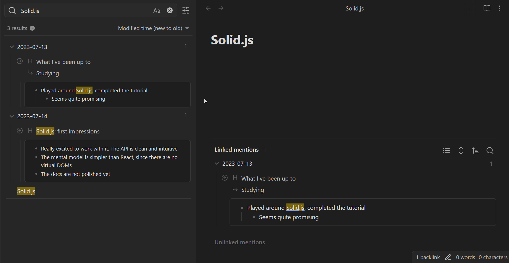
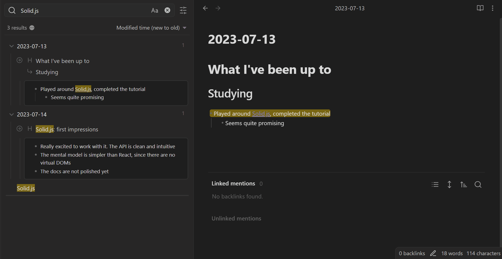

# Better Search Views

> **Warning**
>
> - You need to reload Obsidian after you **install/update/enable/disable** the plugin
> - The plugin reaches into Obsidian's internals, so it may break after an update. If you noticed that, [please create an issue](https://github.com/ivan-lednev/better-search-views/issues)

## How to use it

Just install it and reload Obsidian. Now Obsidian's built-in global search, backlinks and queries should be decorated with breadcrumbs.

## What it does

### Before 'Better Search Views', search results look like this:

### After 'Better Search Views' they look like this:

### A closer look

Let's open one of the files with matches, and see how the hierarchy in the search result matches the file:

### But what does it do exactly?

The plugin brings more outliner goodness into Obsidian: it improves search views to create an outliner-like context around every match.
- **It patches native search, backlinks view, embedded backlinks and embedded queries**
- It renders markdown in the match to HTML
- It builds structural breadcrumbs to the match by chaining all the ancestor headings and list items above
- If the match is in a list item, it displays all the sub-list items below it
- If the match is in a heading, it displays the first section below the heading (you know, for context)

### Backlinks in document look like this

### Embedded queries look like this

### Clicking on breadcrumbs works just as you might expect

### Hovering over any element with the control key pressed triggers a pop-up

## Contribution

If you noticed a bug or have an improvement idea, [please create an issue](https://github.com/ivan-lednev/better-search-views/issues).

Pull-requests are welcome! If you want to contribute but don't know where to start, you can create an issue or write me an email: <bishop1860@gmail.com>.

You can also support the development directly:

# Acknowledgements

- Thanks to [TFTHacker](https://tfthacker.com/) for [his plugin](https://github.com/TfTHacker/obsidian42-strange-new-worlds), which helped me figure out how to implement a bunch of small improvements
- Thanks to [NothingIsLost](https://github.com/nothingislost) for his awesome plugins, that helped me figure out how to patch Obsidian internals
- Thanks to [PJEby](https://github.com/pjeby) for his [patching library](https://github.com/pjeby/monkey-around)
